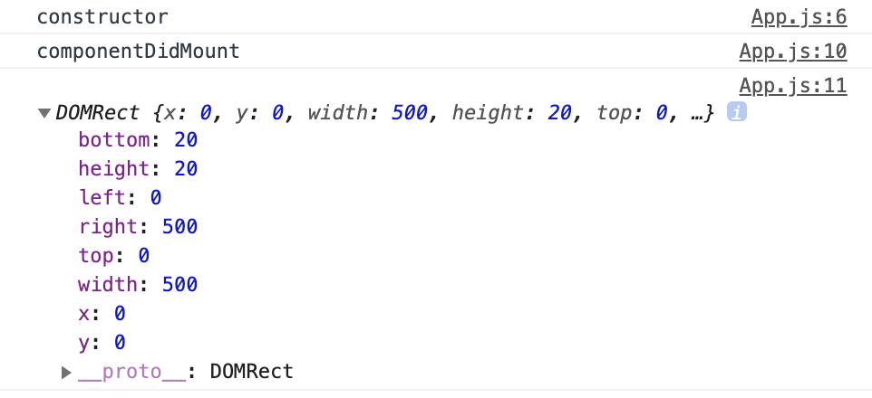

This project was bootstrapped with [Create React App](https://github.com/facebook/create-react-app).

## Available Scripts

In the project directory, you can run:

### `npm start`

Runs the app in the development mode.<br>
Open [http://localhost:3000](http://localhost:3000) to view it in the browser.

The page will reload if you make edits.<br>
You will also see any lint errors in the console.

### `npm test`

Launches the test runner in the interactive watch mode.<br>
See the section about [running tests](https://facebook.github.io/create-react-app/docs/running-tests) for more information.

### `npm run build`

Builds the app for production to the `build` folder.<br>
It correctly bundles React in production mode and optimizes the build for the best performance.

The build is minified and the filenames include the hashes.<br>
Your app is ready to be deployed!

See the section about [deployment](https://facebook.github.io/create-react-app/docs/deployment) for more information.

### `npm run eject`

**Note: this is a one-way operation. Once you `eject`, you can’t go back!**

If you aren’t satisfied with the build tool and configuration choices, you can `eject` at any time. This command will remove the single build dependency from your project.

Instead, it will copy all the configuration files and the transitive dependencies (Webpack, Babel, ESLint, etc) right into your project so you have full control over them. All of the commands except `eject` will still work, but they will point to the copied scripts so you can tweak them. At this point you’re on your own.

You don’t have to ever use `eject`. The curated feature set is suitable for small and middle deployments, and you shouldn’t feel obligated to use this feature. However we understand that this tool wouldn’t be useful if you couldn’t customize it when you are ready for it.

## Learn More

You can learn more in the [Create React App documentation](https://facebook.github.io/create-react-app/docs/getting-started).

To learn React, check out the [React documentation](https://reactjs.org/).

### Code Splitting

This section has moved here: https://facebook.github.io/create-react-app/docs/code-splitting

### Analyzing the Bundle Size

This section has moved here: https://facebook.github.io/create-react-app/docs/analyzing-the-bundle-size

### Making a Progressive Web App

This section has moved here: https://facebook.github.io/create-react-app/docs/making-a-progressive-web-app

### Advanced Configuration

This section has moved here: https://facebook.github.io/create-react-app/docs/advanced-configuration

### Deployment

This section has moved here: https://facebook.github.io/create-react-app/docs/deployment

### `npm run build` fails to minify

This section has moved here: https://facebook.github.io/create-react-app/docs/troubleshooting#npm-run-build-fails-to-minify
# react_basic_byVELOPERT


### #5 ~ #7

var    : 스코프가 함수 단위, 더이상 never,,,
const  : 스코프가 블록 단위, 한번 선언 후 고정적인 값
let    : 스코프가 블록 단위, 유동적인 값

삼항연산자로 데이터 구하기, if 사용 안함, switch 사용 가능. 
조건이 많으면 외부에서 하도록 하라...

{/* && 사용해서 true인것만 표현 */}

```Shell
    { name === 'velopert!!' && <div>벨로퍼트다!!</div>} 

    { name === 'Robert!!' ? '아이언맨이닷!' : '너는 누구냐!!'}
```

{/* 조건이 여러개일 경우 */}

```Shell
    {
        (
            function() {
            if (value === 1) return <div>아이언맨 ???</div>
            if (value === 2) return <div>벨로퍼트 ???</div>
            if (value === 3) return <div>누구 ???</div>
            return <div>모르겠네...</div>
            }
        )()
    }
```

{/* 조건이 여러개일 경우 , 화살표 함수 사용 (바로 실행하는거니까 끝에 () 꼭 붙여주기) 
    this, arguments, super 개념이 없음!!!
*/}

```Shell
    { 
        (
            () => {
            if (name === 'Robert!!') return <div>아이언맨 ???</div>
            if (name === 'velopert!!') return <div>벨로퍼트 ???</div>
            if (name === 'Stave!!') return <div>누구 ???</div>
            }
        )()
    }
```

### #8 Props

읽기 개념
모든 컴포넌트는 render()가 존재해야 한다.
부모 컴포넌트가 자식 컴포넌트에게 값을 넘겨줄 때 사용.

class 내부에 defaultProps 를 선언하는 것이 최신 문법

1. class 내부 선언

```Shell
    class MyName extends Component {

        static defaultProps = {
            name: 'RRobert John Downey Jr.'
        }
        render() {
            return (
                <div>
                    안녕하세요 ! 제 이름은 <b>{this.props.name}</b>입니다.
                </div>
            )
        }
    }
```

2. class 아랫쪽


- 함수형 컴포넌트
  ({ name }) => 이것은 비구조 할당 문법
  함수형 컴포넌트는 초기 마운트 속도가 (미세하게) 빠름.
  메모리 자원도 적게 사용하는 편이라고 함!

```Shell
    import React, { Component } from 'react';

    const MyName = ({ name }) => {
        return <div> 안녕!! 나는 { name } 이라고 햇! </div>
    };

    MyName.defaultProps = {
        name: 'Robert John Downey Jr.'
    };

    export default MyName;
```

### #9 State

- 컴포넌트 자기 자신이 가지고 있음.
- 처음부터 가지고 있음.
- 변화가 필요하면 setState() 이용하여 업데이트 가능.

- state를 정의할 때는 반드시 객체여야 한다.

```Shell
    state = {
        number: 0
    }

    // 화살표 함수를 한 이유! 하지 않으면 this를 알기 어렵다. 소스가 복잡해짐

    handleIncreate = () => {
        this.setState({
            number: this.state.number + 1
        })
    }

    // 이런 경우 this는 모름!!
    // 혹여나 사용하고 싶을 경우 , constructor 선언해줘야함.

    constructor(props) {
        super(props);
        this.handleIncreate = this.handleIncreate.bind(this);
        this.handleDecrease = this.handleDecrease.bind(this);
    }

    handleIncreate() {
        console.log(this);
        this.setState({
            this.state.number;
        })
    }
```

### #10 ~ #11 LifeCycle API 

- 컴포넌트가 브라우저기 ... 할 때...
1. 나타날 때 (Mounting)
2. 업데이트 될 때 (Updating)
3. 사라질 때 (Unmounting)


- constructor : 컴포넌트가 새로 만들어질 때 호출 되는 것.
- getDerivedStateFromProps : props 값을 state 값과 동기화 시키고 싶을 때 사용.
- shouldComponentUpdate : 컴포넌트가 업데이트할지 말지 정하는 것. - false의 경우, 아래 로직 호출되지 않고, true 가 되면 아래 화살표 방향으로 진행됨.
- render() 하고 나서 ~
- getSnapshotBeforeUpdate : 실제로 브라우저에 반영되기 바로 직전에 값을 확인.

- Mounting 이 끝나면 => componentDidMount
- Updatind 이 끝나면 => componentDidUpdate
- Unmounting 이 될 때는 => componentWillUnmount 가 호출된다는 것!!!

- componentDidCatch 를 사용해서 만약에 에러가 발생한다면 잡아줄 수 있다!

* shouldComponentUpdate


## componentDidMount

```Shell
    componentDidMount() {
        // 외부 라이브러리 연동: D3, masonry, etc
        // 컴포넌트에서 필요한 데이터 요청: Ajax, GraphQL, etc
        // DOM 에 관련된 작업: 스크롤 설정, 크기 읽어오기 등
    }
```

- ref
 DOM에 ID 같은 붙이는 것과 비슷. 

```Shell
    componentDidMount() {
        console.log('componentDidMount');
        console.log(this.myDiv.getBoundingClientRect());
    }
    render(){
        return (
            <div ref={ref => this.myDiv = ref}>
                <h1>안녕하세요. Robert입니다. </h1>
            </div>
        )
    }
```




## [NEW] static getDerivedStateFromProps()

- 바로 어떤 값을 리턴해주면 바로 state 에 들어간다.
- 업데이트 되는 과정에서도 사용되지만, 컴포넌트가 만들어지는 과정에서도 사용된다.

```Shell
    static getDerivedStateFromProps(nextProps, prevState) {
        // 여기서는 setState 를 하는 것이 아니라
        // 특정 props 가 바뀔 때 설정하고 설정하고 싶은 state 값을 리턴하는 형태로
        // 사용됩니다.
        /*
        if (nextProps.value !== prevState.value) {
            return { value: nextProps.value };
        }
        return null; // null 을 리턴하면 따로 업데이트 할 것은 없다라는 의미
        */
    }
```

## shouldComponentUpdate

- 라이프사이클 API 중에서 업데이트 속도를 최적화할수 있게 해줌.
- 다음 받아올 props, state 값을 받아와서, return true 하면 업데이트가 됨.
- 특정 로직에 따라 false를 반환하게 하게끔하면, 특정 상황에 최적화 할 수 있다.
- 업데이트를 막아줄 수 있는 함수!!!!!
- 특정 조건에 따라 렌더링을 막아주는 함수!!!!

```Shell
    shouldComponentUpdate(nextProps, nextState) {
        // return false 하면 업데이트를 안함
        // return this.props.checked !== nextProps.checked
        return true;
    }
```


## [NEW] getSnapshotBeforeUpdate()

- 컴포넌트가 업데이트 되어서, 브라우저의 돔에 반영되기 바로 직전에 호출됨.
- 이 때, 할 수 있는 작업은 ? 업데이트 바로 직전의 DOM의 상태를 리턴시켜서 , 그 리턴된 값을 컴포넌트에 업데이트해서 받아올 수 있다. 

- 발생 시점
1. render()
2. getSnapshotBeforeUpdate()
3. 실제 DOM 에 변화 발생
4. componentDidUpdate

```Shell
getSnapshotBeforeUpdate(prevProps, prevState) {
    // DOM 업데이트가 일어나기 직전의 시점입니다.
    // 새 데이터가 상단에 추가되어도 스크롤바를 유지해보겠습니다.
    // scrollHeight 는 전 후를 비교해서 스크롤 위치를 설정하기 위함이고,
    // scrollTop 은, 이 기능이 크롬에 이미 구현이 되어있는데, 
    // 이미 구현이 되어있다면 처리하지 않도록 하기 위함입니다.
    if (prevState.array !== this.state.array) {
      const {
        scrollTop, scrollHeight
      } = this.list;

      // 여기서 반환 하는 값은 componentDidMount 에서 snapshot 값으로 받아올 수 있습니다.
      return {
        scrollTop, scrollHeight
      };
    }
  }

  componentDidUpdate(prevProps, prevState, snapshot) {
    if (snapshot) {
      const { scrollTop } = this.list;
      if (scrollTop !== snapshot.scrollTop) return; // 기능이 이미 구현되어있다면 처리하지 않습니다.
      const diff = this.list.scrollHeight - snapshot.scrollHeight;
      this.list.scrollTop += diff;
    }
  }
```


## componentDidUpdate

- 컴포넌트에서 render() 를 호출하고난 다음에 일어남.
- 컴포넌트에서 실제로 업데이트 되고 나서 호출되는 부분!

```Shell
    componentDidUpdate(prevProps, prevState, snapshot) {
        // 비교 조건, 작업 
    }
```

## componentWillUnmount

- 컴포넌트 제거
- 컴포넌트가 불필요해지면 사라지면서 나타남..

```Shell
    componentWillUnmount() {
    // 이벤트, setTimeout, 외부 라이브러리 인스턴스 제거
    }
```

-  && 사인은 조건이 만족하면 뒷 작업을 실행하라! 라는 의미

```Shell
    {this.state.counter < 10 && <MyComponent value={this.state.counter} />}
```

## componentDidCatch

- 컴포넌트에 에러 발생
- 용도 : 만약에 render 함수에 오류가 발생하면 앱 자체가 crash가 나타난다.
- 이런 에러가 발생할 때, 처리할 수 있는 함수
- 에러 잡는 것은 에러가 발생할 수 있는 `부모` 컴포넌트에서 처리해줘야 함!!!

```Shell
  state = {
    counter: 1,
    error: false    // componentDidCatch() 적용하면 그냥 흰 화면이 나오니까! 안내위해서~ 
  }

  componentDidCatch(error, info) {
    console.log(error); // 어떤 에러가 발생한지
    console.log(info);  // 어디서 발생한지 

    this.setState({
      error: true,
    });
    // or API 통해서 서버로 오류 내용 날리기 를 하거나...? 
  }
```

```Shell
  render(){
    if (this.state.error) {
      return (
        <div>에러가 났어요!!!!!</div>
      )
    }
    return (
      <div ref={ref => this.myDiv = ref}>
          {/* && 사인은 이 조건이 만족하면 뒷 작업을 보여줘라! 라는 의미 */}
          {this.state.counter < 10 && <MyComponent value={this.state.counter} />}
          {/* <MyComponent value={this.state.counter} /> */}
          <button onClick={this.handleClick}>Click Me</button>
      </div>
    )
  }
```

- 위 정보를 네트워크를 통해서 특정 서버에 전달해 준다던지, 단순히 에러가 발생했다고 보여준다던지..
- 우리가 실수로 잡지 못했던 에러를 잡을 때 주로 사용.
- 에러 정보를 실제 개발자가 볼 수 있게 도움.
